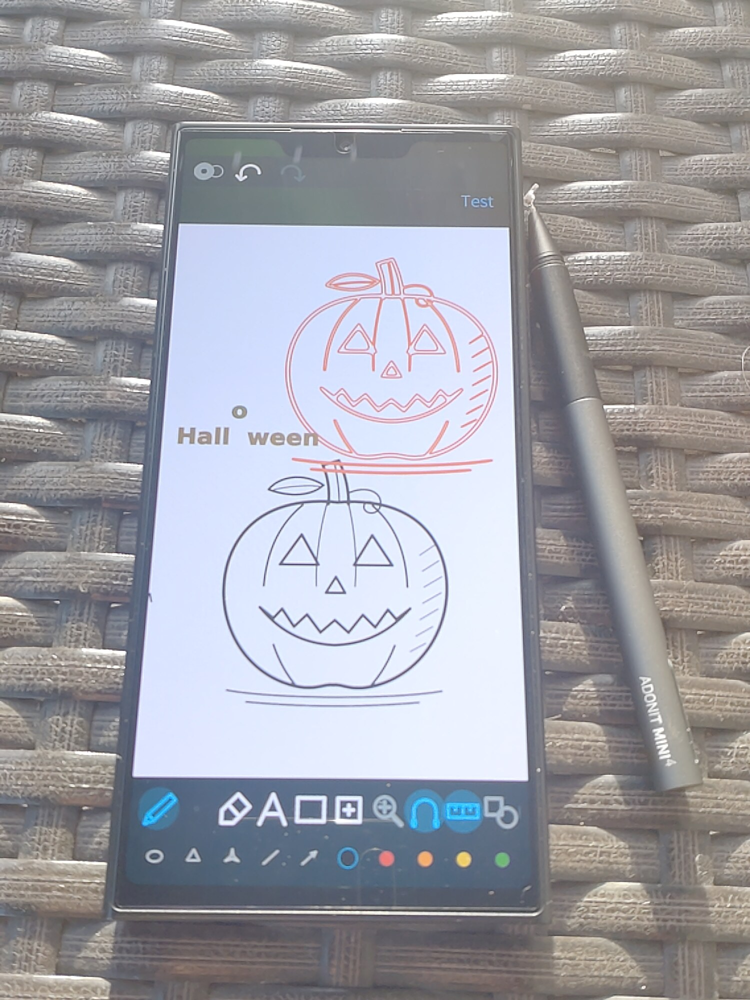
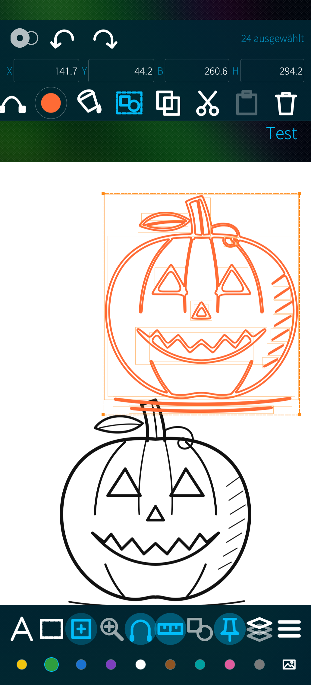
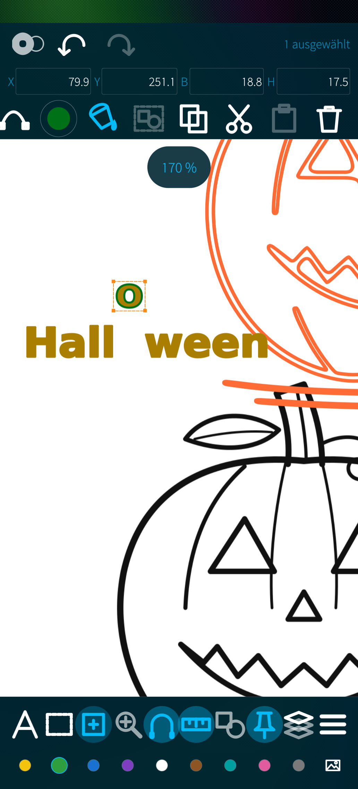
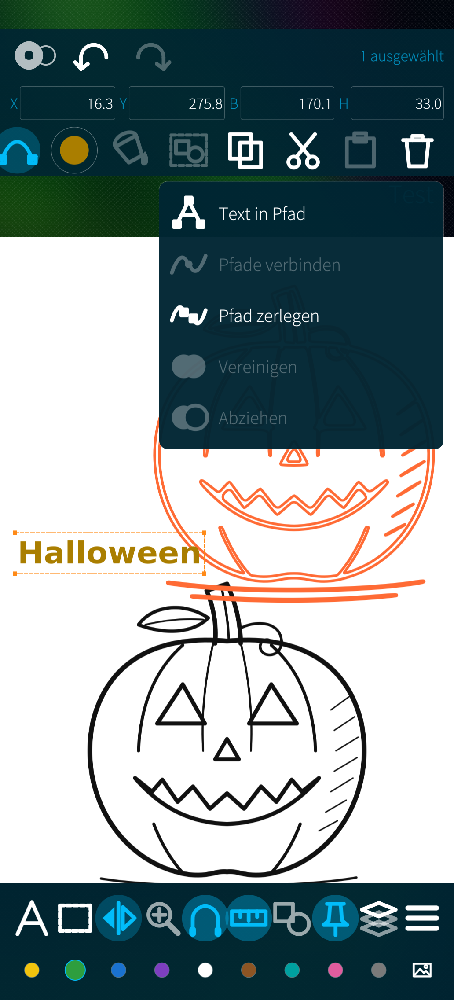
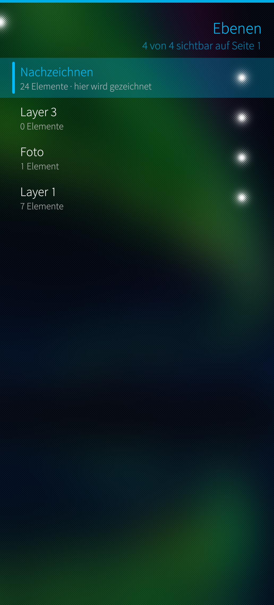
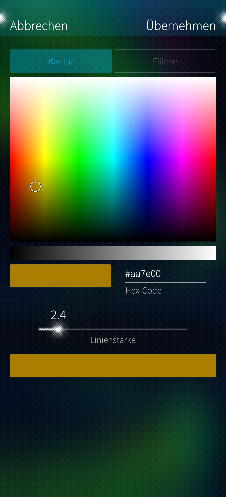
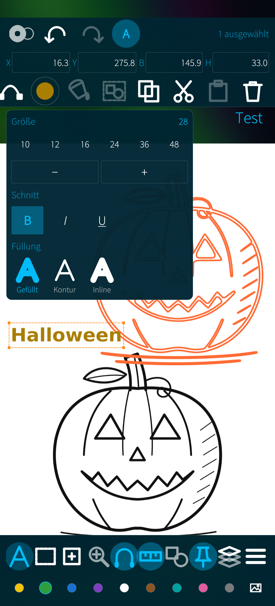
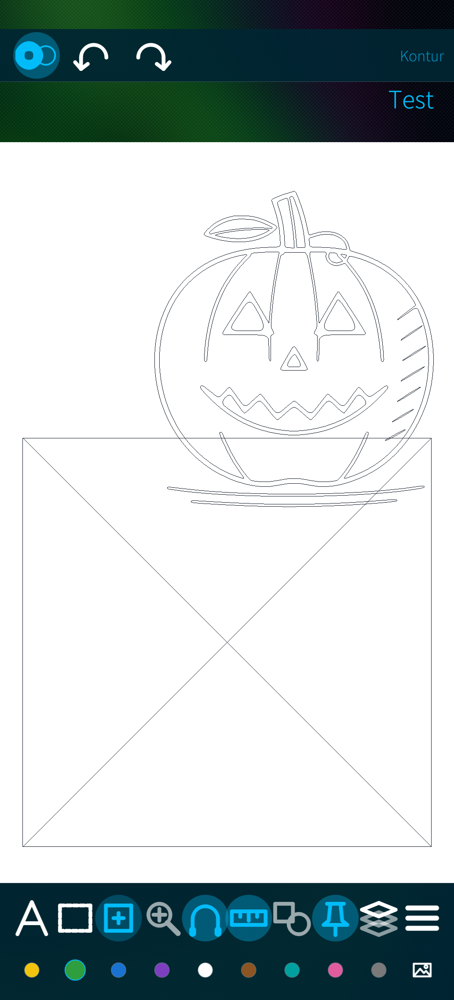
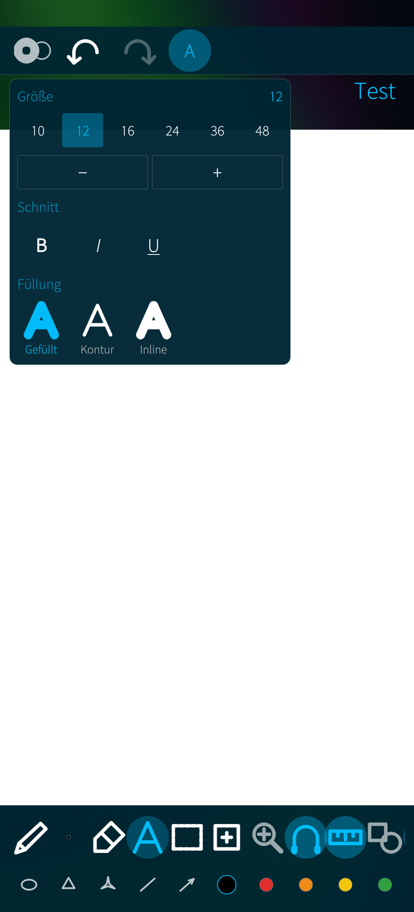
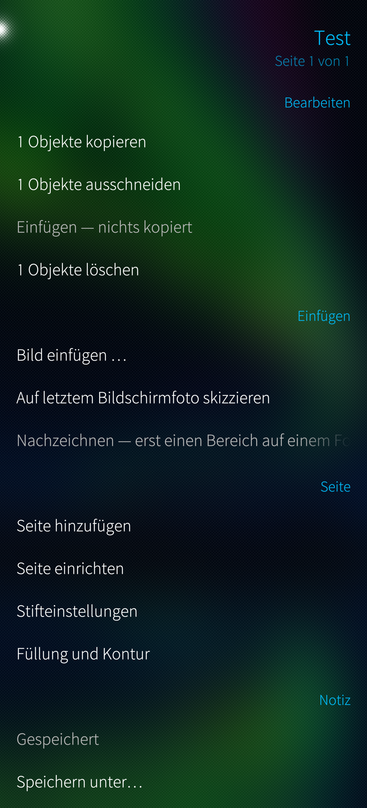

# SJournal

Handwritten notes and vector sketching for Sailfish OS.

A note is a stack of layers of real vector strokes, written to the **.xopp**
format — the same file opens in [Xournal++](https://xournalpp.github.io/) on a
desktop and comes back unchanged. Put a photo on its own layer and draw over
it, straighten a scribble into a clean rectangle, turn a word into outlines and
fill it with a gradient, then export the page as **SVG** with every layer
intact, ready for Inkscape.

<p align="center">
  
</p>

| | | |
|:-:|:-:|:-:|
|  |  |  |
| A traced sketch, selected as vectors | Text turned into paths and broken apart | Path operations |
|  |  |  |
| Layers | Colour picker with hex entry | Text size, weight and fill |
|  |  |  |
| Outline view | Text options | Note menu |

SJournal is written from scratch in C++ and QML with a Silica interface. It is
not a port of Xournal++ and shares no code with it; what it shares is the file
format.

## Drawing

- Four pens behind one button — pen, Bézier, brush and highlighter — plus an
  eraser and a hand tool
- Shape tools that cycle on a tap: circle and rectangle, polygon counting its
  own corners from 3 to 12, star, line → polyline → spline → closed spline,
  arrow
- Shape recognition on a switch: a scribbled line, circle, ellipse, rectangle
  at any angle, triangle, polygon or arrow straightens itself — and a scribble
  that was meant to stay a scribble is left alone
- Snapping to existing points, and a 5 mm size grid with a millimetre readout
- Text with weight, fill style and any size

## Editing what is already on the page

- Select whole paths, or switch the same slot to node editing and drag the
  points themselves; a Bézier anchor shows its two control handles. A stroke
  with hundreds of points can be thinned down to a handful first.
- Pick with a rectangle, a free lasso, or one element at a time
- Move, resize from the corners, flip horizontally or vertically
- Type exact X, Y, width and height into the bar at the top
- Colour, line width, fill and transparency of anything already drawn, with a
  colour picker that has a hue field, a grey ramp and hex entry
- Gradients with two to five stops and a free angle
- Path operations: text to path, join, break apart, add together, subtract —
  and a letter keeps the hole in its middle

## Pages, layers, files

- Multiple pages; plain, lined, graph or dotted ruling
- Layers: add, rename, reorder, hide, isolate, lock
- A photo from the gallery becomes its own layer with a drawing layer above it
- Trace a marked part of a photo into editable vector outlines
- Notebook list with thumbnails, searching titles and text
- Export: SVG with Inkscape layers, PNG, JPEG, WebP, and vector PDF
- English and German, switchable under About

## About the stylus

The screen is an ordinary capacitive panel with no digitiser in it. Active pens
that need one — Microsoft Pen Protocol, Wacom EMR, Apple Pencil — cannot work,
in this or any other app on such a device. A passive capacitive stylus works
fine.

Because there is no pressure to read, stroke width comes from drawing speed
instead: draw faster and the line thins out. That is what gives handwriting its
taper, and it is a choice, not a substitute.

Palm rejection uses the size of the touch contact, and only when the panel
reports one. One finger draws, two fingers pan and zoom.

## Building

```sh
mb2 -t SailfishOS-5.2.0.17-aarch64 build
```

## Licence

GPLv3. The vendored potrace tracing core is GPL-2.0-or-later and the vendored
zinnia recogniser is under the new BSD licence; see `THIRD-PARTY.md`.
